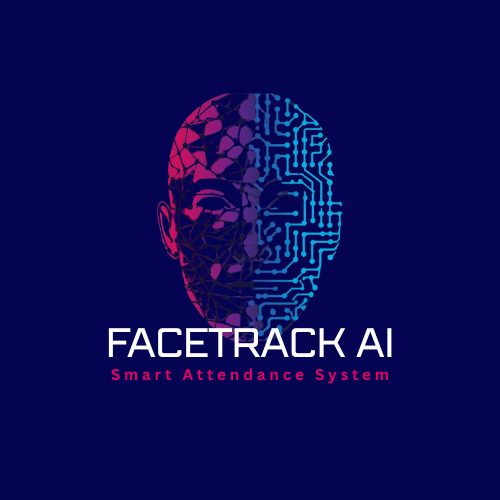

<h1 align="center">
  AI Attendance System
</h1>

  

<h2>📌 Live Demo & Repository</h2>
<ul>
  <li><a href="https://taksimsquare12.github.io/face-attendance-system/">Live Demo</a></li>
  <li><a href="https://github.com/taksimsquare12/face-attendance-system">GitHub Repository</a></li>
</ul>

<h2>📖 Project Overview</h2>

  The AI Attendance System is a web-based application designed to manage student attendance using modern web technologies. 
  It provides CRUD functionality, theme toggling, and responsive layouts for committee-ready submissions.

<h2>✨ Key Features</h2>
<ul>
  <li><b>AI-Powered Attendance:</b> Automates student attendance tracking using face recognition and smart algorithms.</li>
  <li><b>CRUD Operations:</b> Add, view, update, and delete student records dynamically with JavaScript and DOM manipulation.</li>
  <li><b>Responsive Design:</b> Tailwind CSS ensures the system works seamlessly across desktop, tablet, and mobile devices.</li>
  <li><b>Dark/Light Mode Toggle:</b> Built-in theme switcher for accessibility and user preference.</li>
  <li><b>Search Functionality:</b> Quickly find student records by name using live search filters.</li>
  <li><b>Reusable Components:</b> Navbar, footer, and card layouts are consistent across all pages for professional presentation.</li>
  <li><b>LocalStorage Integration:</b> Stores user signup/login data and attendance records for persistence.</li>
  <li><b>Committee-Ready Documentation:</b> Includes README, screenshots, and structured project folders for easy review.</li>
</ul>

<h2>🛠 Technologies Used</h2>
<ul>
  <li>HTML5</li>
  <li>Tailwind CSS</li>
  <li>JavaScript (ES6+)</li>
  <li>LocalStorage (for persistence)</li>
</ul>

<h2>📂 Project Structure</h2>
<pre>
face-attendance-system/
 ├── index.html              
 ├── assets/
 │    └── images/   
 │    └── audios/
 │    └── videos/ 
 │    └── pdfs/             
 │
 ├── src/
 │    └── pages/
 │         ├── home/
 │         │    ├── home.js
 │         ├── signin/
 │         │    ├── signin.html
 │         │    └── signin.js
 │         │
 │         ├── signup/
 │         │    ├── signup.html
 │         │    └── signup.js
 │         │
 │         ├── records/
 │         │    ├── records.html
 │         │    └── records.js
 │         │
 │         ├── database/
 │         │    ├── student.js  
 │         │    └── record.js   
 │         │
 │         ├── blog/
 │         │    └── blog.html
 │         │    └── blog.js
 │         │
 │         ├── about/
 │         │    └── about.html
 │         │    └── about.js
 │         │
 │         ├── contact/
 │         │    └── contact.html
 │         │    └── contact.js
 │         │
 │         └── constants/
 │              └── themeConstants.js
 │
 └── README.md                 # Project documentation
</pre>

<h2>🚀 How to Run the Project</h2>
<ol>
<li>Clone the repository: <code>git clone https://github.com/taksimsquare12/face-attendance-system</code></li>
  <li>Open the project folder in VS Code.</li>
  <li>Run using Live Server or open <code>index.html</code> in your browser.</li>
</ol>

<h2>📸 Screenshots</h2>

  

  

  

  

